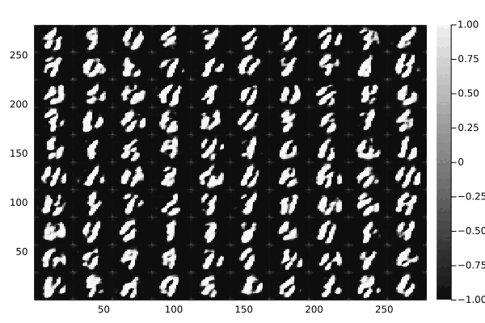

# Learning the MNIST dataset using GANs with Fluxml
You want a Generative Adversial Network to learn the MNIST dataset using Julia's
[FluxML](https://www.fluxml.ai) library? This repository has you covered. It implements numerous GAN architectures
that learn the MNIST dataset:
* Vanilla [GAN](https://arxiv.org/abs/1406.2661)
* [Conditional](https://arxiv.org/abs/1411.1784) Deep Convolutional GANs

Each architecture is trained through a separate script. These parse command line options and configure
various parameters of the model accordingly. This makes it easy to configure training for large
hyperparamer scans.

To get started simply clone the repo and run

```
$ julia --project=. -i src/runme.jl
```
to train a vanilla GAN. To list the parameters run this command

```
$ julia --project=. src/runme.jl --help
```

To train a CDCGAN run
```
$ julia --project=. -i src/runme_cdcgan.jl
```
Generated digits in the first 10 epochs look like this:





